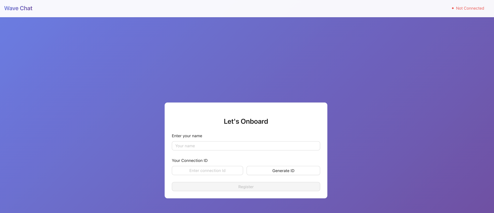
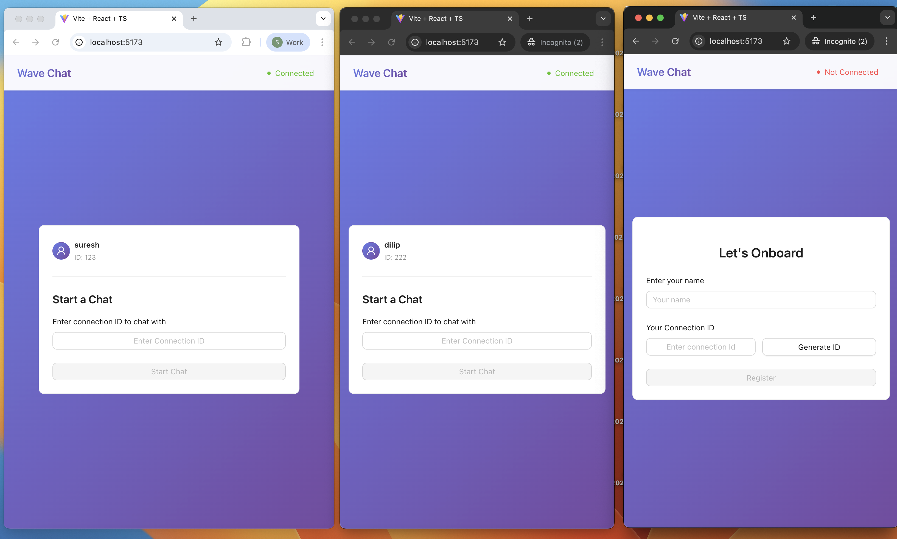
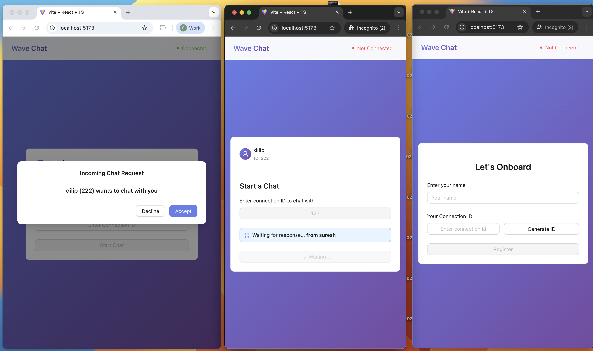

# Wave Chat

A real-time 1:1 chat application built with React, Socket.IO, and TypeScript.

## Features

- **User Registration** - Register with a unique connection ID and display name
- **Real-time Chat** - Instant messaging via WebSocket connections
- **Chat Requests** - Send and receive chat requests between users
- **Busy User Handling** - Handle cases when target user is already in a chat (POC only)
- **Multi-Tab Prevention** - Prevents same user from opening multiple tabs
- **Chat History** - Persisted locally in browser storage
- **Auto-Reconnection** - Automatic reconnection on network issues
- **Context API** - React context api to manage state

## Architecture Highlights

- **Manual Dependency Injection** - Clean separation of concerns in backend
- **Typed WebSocket Events** - Compile-time safety for all socket communications
- **Repository Pattern** - In-memory user storage with interface abstraction
- **React Context** - Centralized state management for user and chat data
- **monorepo** - Using monorepo
- **websocket Events Types** - Included in shared package, common for both UI and BE 
- **Logs** -  logs can be accessed in /backend/logs/ folder

## Project Structure

```
├── shared/    # Shared WebSocket types package
├── backend/   # backend logic - 3 layered with Manual DI
├── frontend/  # FE code

```

## Getting Started

### Prerequisites

- Node.js (v18+)
- pnpm

### Installation

1. **Install dependencies:**
   ```bash
   cd ../code-challenge/ && pnpm install
   ```

### Running the Application

1. **Start the backend server:**
   ```bash
   cd ../code-challenge/ && pnpm run dev
   ```
   Server runs on `http://localhost:3001`
   App runs on `http://localhost:5173`


## REST API Endpoints

| Method | Endpoint | Description |
|--------|----------|-------------|
| GET | `/chat/connection-id/generate` | Generate a new connection ID |
| POST | `/chat/connection-id/validate` | Validate a connection ID |
| POST | `/chat/connection-id/register` | Register a user with connection ID and name |

## WebSocket Events

### Client → Server

| Event | Payload | Description |
|-------|---------|-------------|
| `user:register` | `{ connectionId }` | Register user with socket |
| `chat:request` | `{ targetConnectionId }` | Request chat with another user |
| `chat:response` | `{ fromConnectionId, accepted }` | Accept/decline chat request |
| `chat:message` | `{ message }` | Send chat message |
| `chat:leave` | `{}` | Leave current chat |

### Server → Client

| Event | Payload | Description |
|-------|---------|-------------|
| `user:registered` | `{ success, error? }` | Registration result |
| `chat:incoming-request` | `{ from, fromName }` | Incoming chat request |
| `chat:request-result` | `{ success, error?, isBusy?, targetName? }` | Chat request result |
| `chat:started` | `{ sessionId, partnerId, partnerName, isInitiator }` | Chat session started |
| `chat:message-received` | `{ id, from, fromName, content, timestamp }` | Message received |
| `chat:ended` | `{ reason, message }` | Chat ended |

## Tech Stack

### Frontend
- React 18+
- TypeScript
- Vite
- React Router
- Socket.IO Client
- Ant design
- Ant themes token 
- RTL

### Backend
- Node.js
- Express
- TypeScript
- Socket.IO
- Zod (validation)
- Winston (logging)

### Shared
- TypeScript
- Strongly-typed WebSocket events and payloads


## Logging

Backend logs are stored in `backend/logs/`:
- `combined.log` - All logs
- `error.log` - Errors only

## Testing

```bash
cd ../code-challenge/ && pnpm run test
```

### Caveats:

- Test cases can to be improved by integrating e2e testing and more scenarios can be added.
- UI is minimal for the sake of POC.
- Use of localStorage - only for POC and not for production.

### Next Action items:

- Improve UI
- Implement user on-boarding
- Connect to DB
- Inversify for production
- Support multi user chat
- Busy User Handling : can be improved to let target user know that someone is trying to reach them. 

### Screenshots






